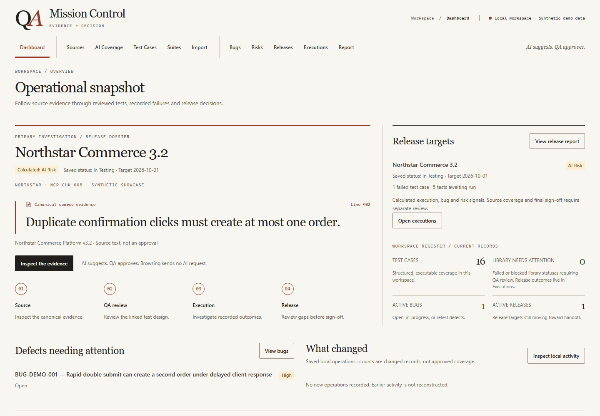

# QA Mission Control

**Turn complex specifications into accountable, traceable QA coverage.**

A local-first workbench for QA leads and engineers who need to explain what is
covered, where the evidence came from, and what still prevents release.
**AI suggests. QA approves.**

[Quick start](#try-the-zero-key-demo) · [90-second demo](docs/demo.md) · [Architecture](docs/architecture.md)



## Try the zero-key demo

Use Node.js **22.13+ or 24+** and npm 10+ in a fresh checkout:

```sh
npm ci
npm run dev -- --host 127.0.0.1
```

Open the local URL printed by Vite and select **Load synthetic demo workspace**
on the dashboard (expand **Explore a synthetic example** in a populated workspace).
The same loader is available under **Import → Workspace backup & restore**.
Confirm replacement only in a disposable workspace, or export
your existing data first. No account, API key or provider is needed.

Follow Northstar Commerce 3.2: inspect NCP-CHK-005 duplicate-order evidence, review
its four linked scenarios, investigate BUG-DEMO-001, and review the At Risk release decision.
The complete 114-requirement specification and five-item change notice are preserved. Saved coverage, gaps and version conflicts are available without AI. The data and QA history are explicitly synthetic. [90-second demo script](docs/demo.md)

## The workflow

**Source → Requirement → Evidence → Coverage → QA-approved Test → Execution → Bug / Release → Change impact**

Requirements are first-class records with application-owned source locations.
Coverage links refer to exact requirement and test versions. QA explicitly
confirms coverage or approves eligible suggestions before importing tests.
Executions record results against a release and test design. Changed source
regions retain historical impact evidence without silently transferring approval.

This is a requirements-to-release workbench: the useful output is an accountable
QA decision, supported by evidence, gaps and failures. It includes Sources,
coverage planning, Test Cases, Suites, manual Executions, Bugs, Risks and reports.

## What you can trust

| Surface | Status and boundary |
| --- | --- |
| Local QA workflow, canonical evidence, guarded approval, versioned traceability, backup/restore | Established product capabilities, verified with deterministic tests. No hosted compliance claim. |
| Live requirement extraction and AI test suggestions | Optional, experimental interpretation. Can omit or misread meaning; QA review is required. |
| Northstar showcase | Deterministic synthetic records. Loading and the guided journey call no provider. |
| Evaluation | Measured limitations inform review boundaries; synthetic tests verify product behavior. |

**An exact evidence match proves a location, not semantic correctness.** The
application owns canonical provenance; models cannot grant approval. Ambiguity,
partial analysis, visual-review needs and stale results stay visible.

## Architecture and evidence

React 19 + TypeScript, Vite, IndexedDB, browser workers, server-side Groq adapters,
Vitest / Testing Library, and Playwright. Import reviewed TXT, Markdown, DOCX or
selectable PDF text. Preserve local page/table locations where the importer can
establish them. Export validated workspace JSON and Markdown release reports.

- [Architecture and trust boundaries](docs/architecture.md)
- [Evaluation methodology and honest limitations](docs/evaluation.md)
- [Portfolio case study](docs/case-study.md)
- [Measured performance and reproduction](PERFORMANCE.md)
- [Security and privacy](SECURITY.md)

Existing validation reconstructed a 380-page specification; semantic evaluation
used a deliberately selected 36-region sample, not the whole document. Mechanical
grounding passed checks that semantic quality did not. Those failures shaped the
human-review boundaries. Synthetic scale tests separately exercise 500-page
imports and large workspaces. None of these numbers promises extraction accuracy.

## Optional Live AI

The demo and manual QA workflow work without Live AI. Plain Vite serves the app
and local OCR endpoint; it does **not** serve the AI serverless routes.
For an explicitly configured local backend, see [setup](docs/setup.md).
Provider keys belong only on the server, never in a `VITE_` variable or browser.
Source regions are sent only after an explicit action. Output remains review
material, and no Test Case is imported automatically.

## Verification

```sh
npm run lint
npm test
npm run build
npx playwright install chromium
npm run test:e2e
```

CI runs these checks with Node 24 and Chromium. Browser tests mock AI locally;
they do not need a provider key. [Contributing and test scope](CONTRIBUTING.md)

## Project status

Local-first, single-browser workspace; no hosted
accounts, multi-user collaboration or automatic test execution. Large restores
can take around two minutes. Scans, diagrams and OCR need human review.

## License

Licensed under the [MIT License](LICENSE).
Copyright (c) 2026 [Ranb972](https://github.com/Ranb972).
Dependencies and bundled assets retain their own [third-party notices](THIRD_PARTY_NOTICES.md).
