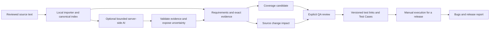

# Architecture and trust boundaries

The product keeps evidence, interpretation and approval separate.

## Source and interpretation

The browser imports selected files into reviewed text. Original attachments are
not persisted. DOCX tables and PDF pages retain bounded local provenance when
available; editing text detaches obsolete file locations. Sources are segmented
locally so unprocessed, failed and visual regions remain accountable.

Production requirement extraction validates an exact quote and occurrence in the
bounded source region. The application calculates canonical identities, offsets
and line/page/table locations. It rejects unsupported evidence and stale results.

Optional whole-specification AI jobs send one bounded region per request, at most
6,000 characters / 18,000 UTF-8 bytes, with two concurrent requests. Explicit
preflight, bounded retry, pause/resume and exact reuse avoid hidden full-document
requests. A matched quote does not establish entailment or completeness.

## Approval and downstream meaning

Requirements are durable findings; they are not automatically approved tests.
Coverage saving, reviewed-test linking and suggestion approval are distinct
operations. Eligible suggestions require explicit QA approval and import.
Known ambiguity and related-source conflicts cannot be bypassed by broad legacy
drafting. Neither provider-authored IDs nor confidence grant canonical authority.

Test links capture the exact current design. Manual release executions record a
design fingerprint, so old runs cannot prove a changed test passed. Release
baselines snapshot requirement identities; a baseline is not approval. Reports
show uncovered work, failures, unresolved findings and incomplete source regions.

Exact unchanged source regions may retain their links. Changed regions expose
historical evidence and affected coverage, tests, suites, executions and releases.
Before/after comparison never silently relinks or transfers approval.

## Storage and transport

IndexedDB transactions guard mutations and atomically restore validated packages.
Version checks reject stale writes; schema upgrades preserve existing records and
close incompatible older tabs. Workers handle bounded imports and large transfer
work. Backups are plaintext JSON and include reviewed source/QA data, not original
binary attachments, prompts, raw provider envelopes or credentials.

The browser calls application-relative endpoints with omitted ambient credentials
and rejected redirects. Server adapters validate bounded contracts and add their
own provider authorization. Local OCR sends a single page to the application
host; Windows OCR is optional and other platforms retain manual transcription.
There is no automatic cloud OCR fallback.

This architecture is local-first, not a hosted authentication, collaboration or
compliance system. See [security](../SECURITY.md) and [evaluation](evaluation.md).
