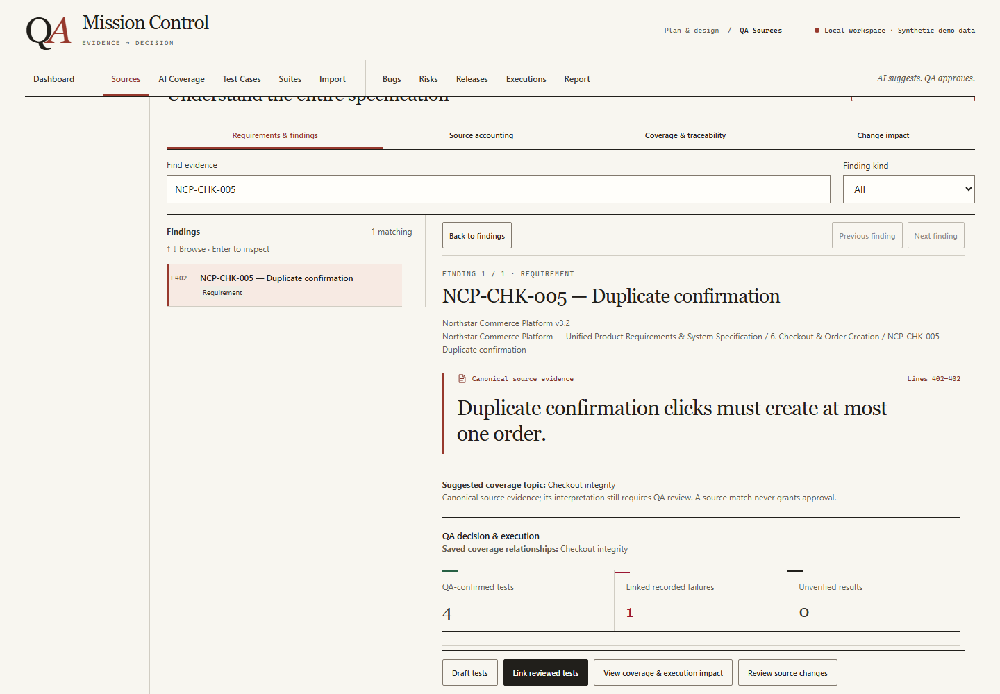
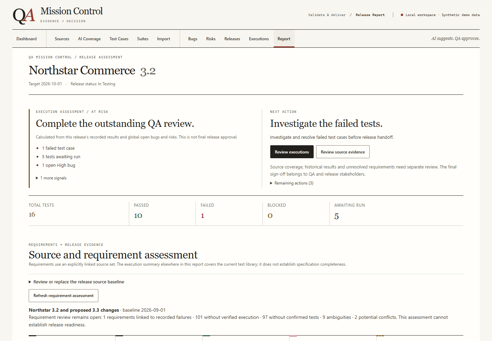

# Northstar: a deterministic QA investigation

Start the app and choose **Load synthetic demo workspace** on Dashboard. In an
existing workspace, expand **Explore a synthetic example** or use **Import →
Workspace backup & restore** to reach the same loader. Confirm
replacement only in a disposable browser workspace or after exporting existing
work. No account, API key or Live AI is needed. Northstar and all seeded QA history
are entirely fictional, suitable for demonstration.

The loader uses the complete supplied [v3.2 specification](../demo-source-candidate/northstar-commerce-platform-v3.2-spec.md)
and [v3.3 change notice](../demo-source-candidate/northstar-commerce-platform-v3.3-change-notice.md).
These are the only two Demo Sources. The main inventory has 114 numbered findings:
106 testable requirements/rules and eight review-required ambiguities. The notice
adds five change items, including one unresolved policy proposal. Across both
sources, 13 of 110 testable findings have reviewed test links. The remaining 97
have no confirmed test; a saved coverage-topic link is not proof of testing.

## The 90-second story

| Stop | Action and meaning |
| --- | --- |
| Dashboard | **Northstar Commerce 3.2 — At Risk**. One duplicate-order failure and five tests awaiting run need attention. |
| Source and evidence | **Inspect the evidence** → select **NCP-CHK-005 — Duplicate confirmation**. The exact source sentence says duplicate clicks must create at most one order. Its line location belongs to the application. |
| Coverage | **AI Coverage** opens saved, synthetic coverage without a provider. Filter **Coverage attention → Linked recorded failures** and expand **Checkout integrity**. Four reviewed scenarios link to NCP-CHK-005; one failed and one awaits execution. |
| Test design | **Test Cases** → search **NCP-CHK-005**. Inspect the single-confirmation, rapid double-confirmation, client-timeout retry and notification-replay tests. Their expected results and QA links remain explicit. |
| Recorded failure | **Executions → Show failed tests** → select the rapid-double-confirmation test. The synthetic observation records two order IDs for one logical identity. |
| Defect and decision | **Bugs → BUG-DEMO-001**, then **Release Report**. At Risk reflects the actual failed result, pending runs, High defect and unresolved policy risk. Next: investigate the duplicate, run timeout/recovery checks and review source scope. No readiness percentage or automatic approval is claimed. |
| Change review | **Sources → Source sets** compares both claims. In the main source's **Change impact** view, expand **Marketplace return fallback** to inspect the affected coverage, return-eligibility test and release. Checkout links remain intact. |

## Review the version boundary

NCP-REF-003 in v3.2 deliberately leaves marketplace fallback undefined.
NCP-CHG-001 proposes 45 days for v3.3. Both are preserved as current source-set
context; neither silently wins. The related NCP-REF-001 eligibility test needs
review, remains awaiting run, and does not claim a newly approved fallback.
The 15/20-minute reservation clarification is also available for scoped review.

The release remains **At Risk** while failures or High signals need investigation.
Blocked executions and open Critical bugs/risks produce **Blocked**. The supplied
3.3 notice separately proposes that unresolved duplicate-order defects be release
blockers for that future version. Only one release, 3.2, is seeded. Final release
approval remains a human QA decision.

## Try localized source editing

In **Northstar Commerce Platform v3.2**, choose **Edit** and change only the
NCP-CHK-005 Requirement sentence from “at most one order” to “exactly one order.”
Save, then open **Change impact**. Its four linked tests and coverage appear as
historical work needing review. Exact unchanged regions retain their QA links.
A similar title never transfers approval to a replacement finding. Reload the
Demo to reset this local experiment.

## Try the approval boundary

Open NCP-CHK-005 and select **Link reviewed tests**. Inspect a test design and
confirm explicitly before saving. Browsing or matching a quote does not approve
anything. Unresolved cross-source policy context blocks new confirmation for
affected requirements until clarified.

The 16-test library includes Checkout Integrity, Payment Safety, Release Smoke,
Recovery & Continuity, and Security & Audit suites. Secondary anchors cover
payment idempotency, audit evidence, recovery, reservation ambiguity and human
release decisions. This is a readable showcase, not a scale benchmark.

Do not use Analyze or Draft tests during the zero-key tour; these are optional
provider actions. **Open optional AI planner** exposes that separate workflow.

## Product views

